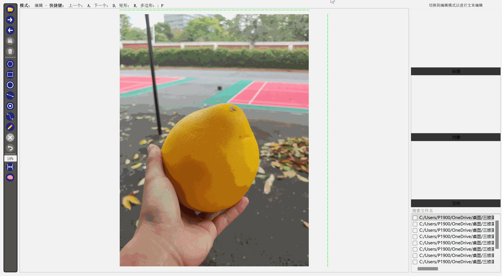

# anylabeling-seg2yolo

This is a tool for converting segmentation masks to YOLO format.

I found it quite convenient to use [X-Anylabeling](https://github.com/CVHub520/X-AnyLabeling) for labeling my segmentation masks, but I needed to convert the labels in json format to Ultralytics-YOLO format for training a YOLOv8 model. So I wrote this tool to automate the process.



## Requirements

- `pathlib` supported by `python 3.6+` 
- `numpy`
- `ruamel.yaml`
- `tqdm` if you want to run `demo.py` (recommended)

## Usage

`json2txt.py` takes majority role in the process, while it's recommended to use `demo.py` for safety.

You can run `json2txt.py` by passing three arguments:

- `config_path`: path to config file in yaml format
- `target_root`: directory to save output txt files, default is `./output`
- `json_dir`: path to directory containing json files

```cmd
python demo.py --config_path config.yaml --target_root output --json_dir data/json
```

## Limitations

This tool is only for converting segmentation masks to YOLO format. It does not handle any other types of annotations.
